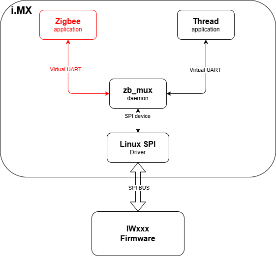
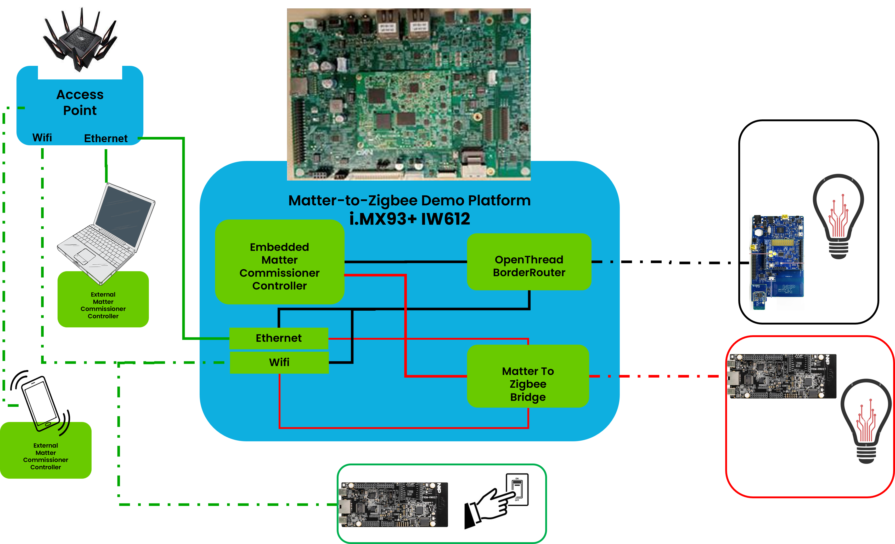

# IWxxx Thread & Zigbee Dualpan solution in NXP i.MX Matter

## Table of contents

[**Introduction**](#introduction)<br>
[**IWxxx Dualpan Architecture**](#iwxxx-dualpan-architecture)<br>
[**IWxxx Zigbee Stack and Examples**](#iwxxx-zigbee-stack-and-examples)<br>
[**Matter to Zigbee Bridge Example**](#matter-to-zigbee-bridge-example)<br>

## Introduction
The IWxxx NXP chipsets ([IW612](https://www.nxp.com/products/IW612), [IW610](https://www.nxp.com/products/IW610)) features highly integrated 2.4/5 GHz dual-band 1x1 Wi-Fi 6, Bluetooth/Bluetooth Low Energy 5.4 and 802.15.4 tri-radio single-chip solution<br>
[NXP i.MX meta-nxp-connectivity Yocto layer](https://github.com/nxp-imx/meta-nxp-connectivity/tree/master) provides Yocto recipes to enable Matter, OpenThread and Zigbee for i.MX MPU<br>
Prerequisite is to follow [instructions](https://github.com/nxp-imx/meta-nxp-connectivity/tree/master?tab=readme-ov-file#How-to-build-the-Yocto-image) to first build the complete **i.MX Matter** image

Following sections specifically describe how to experiment Zigbee & Thread Dualpan features with 3-radio IWxxx NXP chipsets e.g. IW612 or IW610<br>
Dedicated IWxxx Zigbee stack and examples are first introduced<br>
Finally, last section details a complete IWxxx Dualpan example on i.MX: Matter to Zigbee Bridge Application<br>

## IWxxx Dualpan Architecture



Thread and Zigbee i.MX Host applications run on top of a SPI Multiplexer daemon called **zb_mux**<br>
The zb_mux daemon uses i.MX SPI kernel device to exchange Spinel messages with IWxxx Firmware through SPI Bus<br>
The zb_mux daemon also creates two Virtual UART Devices that both Zigbee and Thread applications use to communicate seamlessly with IWxxx Firmware<br>

## IWxxx Zigbee Stack and Examples

meta-nxp-connectivity comes with a certified Zigbee stack for IWxxx chipsets<br>
It is splitted in two Yocto recipes:<br>

* [zigbee-rcp-sdk](https://github.com/nxp-imx/meta-nxp-connectivity/tree/master/meta-nxp-zigbee-rcp/recipes-zigbee-rcp/recipes-zigbee-rcp-sdk): zb_mux daemon, IWxxx Zigbee Stack header files and static libraries and Linux Systemd services&scripts<br>
* [zigbee-rcp-apps](https://github.com/nxp-imx/meta-nxp-connectivity/tree/master/meta-nxp-zigbee-rcp/recipes-zigbee-rcp/recipes-zigbee-rcp-apps): Zigbee Example applications C source code and Readme, IWxxx Zigbee Stack Development Guide documentation<br>

> **_NOTE:_**
Using a NXP account, the Zigbee User Manual .i.e README_Zboss_package_for_Zigbee.txt is available on NXP website<br>
Latest package is [Generic_SD-WLAN-UART-BT-Zigbee-IW612-LNX_6_12_3-IMX8-18.99.3.p23.6-18.99.3.p23.6-MM6X18505.p14-GPL](https://www.nxp.com/webapp/sps/download/license.jsp?colCode=SD-WLAN-UART-BT-Zigbee-IW612-LNX&appType=file1&location=null&DOWNLOAD_ID=null)

### Zigbee SDK

Once the **i.MX Matter** image is built, all **zigbee-rcp-sdk** components can be found in the Yocto build folder<br>
For example, for a *MACHINE=imx93evk-iwxxx-matter* build, components are unpacked in *${MY_YOCTO}/bld-xwayland-imx93evk-iwxxx-matter/tmp/work/armv8a-poky-linux/zigbee-rcp-sdk/1.0/sources-unpack/*
**zigbee-rcp-sdk** goal is to:

* install zb_mux daemon and Systemd Zigbee services on the i.MX Root Filesystem<br>
* install Zigbee header files and static libraries in Yocto build system to build Zigbee example applications<br>

### Zigbee Examples

Similarly to **zigbee-rcp-sdk** components, **zigbee-rcp-apps** components can be found in the Yocto build folder<br>
For example, for a *MACHINE=imx93evk-iwxxx-matter* build, components are unpacked in *${MY_YOCTO}/bld-xwayland-imx93evk-iwxxx-matter/tmp/work/armv8a-poky-linux/zigbee-rcp-apps/1.0/sources-unpack/*
The folder tree content is:<br>

```bash
├── CMakeLists.txt
├── docs
│   ├── readme-example-<example_app>.txt
│   ├── test-example-<example_app>.txt
│   └── zboss-api-user-guide
│       └── html
│           ├── index.html
├── examples
│   ├── cli_nxp
│   ├── custom_cluster
│   ├── distributed
│   ├── dualpan_nxp
│   ├── gp_proxy
│   ├── ias_zone_sensor
│   ├── level_control_sample
│   ├── light_sample
│   ├── manuf_specific_cmds_and_attrs
│   ├── multi_ep
│   ├── onoff_server
│   ├── ota_upgrade_nxp
│   ├── r23_new_api
│   ├── scenes
│   ├── simple_gw
│   ├── tc_swap_out
│   └── thermostat
└── zigbee_rcp_app.cmake
```

#### Zigbee Application Details

* CMakeList.txt: contains all the applications to be built by pointing to the individual "Application CMakeLists.txt" of an application folder
* zigbee_rcp_app.cmake: builds either a ZC_EXE, a ZR_EXE or a ZED_EXE according settings from each individual "Application CMakeLists.txt"

Taking examples/light_sample, its CMakeLists.txt is:

```bash
set(app_proj "examples/light_sample")
project(${app_proj})
message("Project: ${app_proj}")

set(zc_exe "light_zc")
list(APPEND zc_src ${app_proj}/light_coordinator/light_zc.c ${app_proj}/light_coordinator/light_zc_hal.c)
option(ZC_EXE "Build ZC" ON)

set(zr_exe "bulb")
list(APPEND zr_src  ${app_proj}/dimmable_light/bulb.c ${app_proj}/dimmable_light/bulb_hal.c)
option(ZR_EXE "Build ZR" ON)

set(zed_exe "light_control")
list(APPEND zed_src ${app_proj}/light_control/light_control.c ${app_proj}/light_control/light_control_hal.c)
option(ZED_EXE "Build ZED" ON)

include(${CMAKE_CURRENT_SOURCE_DIR}/zigbee_rcp_app.cmake)
```

zigbee_rcp_app.cmake build results are:
|Executable<br>in /usr/bin|Zigbee<br>Device Type|Source files|Zigbee<br>Static libraries|Related docs|
|:-------|:-------|:-------|:-------|:-------|
|light_zc|Coordinator|light_zc.c<br>light_zc_hal.c|libzboss.a|readme-example-light_sample.txt<br>test-example-light_sample.txt|
|bulb|Router|bulb.c<br>bulb_hal.c|libzboss.a|readme-example-light_sample.txt<br>test-example-light_sample.txt|
|light_control|End Device|light_control.c<br>light_control_hal.c|libzboss.ed.a|readme-example-light_sample.txt<br>test-example-light_sample.txt|

#### Create a new Zigbee application
examples/dualpan_nxp currently builds 3 executables: dp_gw_zc, dp_bulb_zr and dp_switch_zed<br>

Based on examples/dualpan_nxp, the new application is **example/my_zigbee_gateway** with only one Zigbee Coordinator executable: **my_zigbee_gw_zc**
```bash
cd ${MY_YOCTO}/bld-xwayland-imx93evk-iwxxx-matter/tmp/work/armv8a-poky-linux/zigbee-rcp-apps/1.0/sources-unpack/
mkdir examples/my_zigbee_gateway
cp examples/dualpan_nxp/dp_gw_zc.c examples/my_zigbee_gateway/my_gw_zc.c
cp examples/dualpan_nxp/dp_gw_zc.h examples/my_zigbee_gateway/
cp examples/dualpan_nxp/dp_gw_device_zc.h examples/my_zigbee_gateway/

cat << EOF > examples/my_zigbee_gateway/CMakeLists.txt
cmake_minimum_required(VERSION VERSION 3.10.2)

set(zc_src "")
set(zr_src "")
set(zed_src "")
set(zc_exe "")
set(zr_exe "")
set(zed_exe "")

set(app_proj "examples/my_zigbee_gateway")
project(\${app_proj})
message("Project: \${app_proj}")

set(zc_exe "my_zigbee_gw_zc")
list(APPEND zc_src \${app_proj}/my_gw_zc.c)
option(ZC_EXE "Build ZC" ON)

include(\${CMAKE_CURRENT_SOURCE_DIR}/zigbee_rcp_app.cmake)
EOF

echo "include(\${CMAKE_CURRENT_SOURCE_DIR}/examples/my_zigbee_gateway/CMakeLists.txt)" >> CMakeLists.txt

cd ${MY_YOCTO}/bld-xwayland-imx93evk-iwxxx-matter
bitbake -fc compile zigbee-rcp-apps
bitbake zigbee-rcp-apps

ls -l tmp/work/armv8a-poky-linux/zigbee-rcp-apps/1.0/image/usr/bin/my_zigbee_gw_zc
```
After a direct transfer in /usr/bin folder of i.MX, new **my_zigbee_gw_zc** executable is available


## Matter to Zigbee Bridge Example

[MatterZigbeeRcp-bridge](https://github.com/NXP/matter/tree/v1.4-branch-nxp_imx_2025_q1/examples/bridge-app/nxp/linux-M2ZigbeeRcp-bridge) application demonstrates the complete Matter example on i.MX93 & IW612<br>


The i.MX Matter image allows to have a complete Matter Controller on one single i.MX93&IW612 platform:<br>

* [Embedded Posix Openthread BorderRouter](https://github.com/nxp-imx/meta-nxp-connectivity/tree/master/meta-nxp-otbr/recipes-otbr/otbr-iwxxx) manages a Thread network and provides Ethernet or Wi-Fi networks connectivity<br>
* [Matter chip-tool](https://github.com/NXP/matter/tree/v1.4-branch-nxp_imx_2025_q1/examples/chip-tool) is used to commission and control Matter Wireless End-Devices, either on Wi-Fi or on Thread networks<br>
* [M2ZigbeeRcp-bridge](https://github.com/NXP/matter/tree/v1.4-branch-nxp_imx_2025_q1/examples/bridge-app/nxp/linux-M2ZigbeeRcp-bridge#readme) is a Zigbee Coordinator allowing Zigbee End-Devices to join, and transforming them into Matter Bridged End-Devices<br>

> **_NOTE:_**
Both meta-nxp-connectivity native otbr-agent-iwxxx and chip-tool executables are not intended to be modified<br>
**M2ZigbeeRcp-bridge** is currently an **example of a Matter to Zigbee bridge**<br>
It is intended to be modified, and its features improved as explained in the [dynamic-endpoint-control](https://github.com/NXP/matter/blob/v1.4-branch-nxp_imx_2025_q1/examples/bridge-app/nxp/linux-M2ZigbeeRcp-bridge/README.md#dynamic-endpoint-control) section<br>
