# Working with the chip-tool-web2

The 'chip-tool-web2' is a web-based graphical user interface (GUI) for the Matter controller, designed specifically for i.MX SoC customers. It provides an intuitive interface for commissioning Matter devices, sending Matter messages and performing other Matter-specific actions.

With the chip-tool-web2, you can easily configure, manage and monitor Matter devices without the need to use complex command lines.

<hr>

-   [Source files](#source)
-   [Building and running the chip-tool-web2](#building)
-   [Using chip-tool-web2 to commission a Matter device](#using)
-   [List commissioned devices in chip-tool-web2](#list)
-   [Subscription of lighting device in chip-tool-web2](#subscription)
-   [Controlling a Matter device mediaplayback cluster](#media)
-   [Opening the commissioning window for the commissioned Matter device](#multiadmin)
-   [Binding for light and switch Matter device](#binding)
-   [Controlling a Matter device Energy EVSE Cluster](#eevse)
-   [OTA updates on chip-tool-web2](#ota)
-   [Additional Notes](#note)
<hr>

<a name="source"></a>

## Source files

You can find the source files for the chip-tool-web2 in the `${matter}/examples/chip-tool/webui-2_0` directory, which are separated into frontend and backend components. This allows easy customization and modification based on specific requirements and use cases.
<hr>

<a name="building"></a>

## Building and running the chip-tool-web2

Before using the chip-tool-web2, you must compile it from source on Linux.

> **Note:** To ensure compatibility, you should always build the chip-tool-web2 from the same revision of the `connectedhomeip` repository.

### Building the chip-tool-web2

The steps to compile the chip-tool-web2 are the same as [How to build Matter application](https://github.com/nxp-imx/meta-nxp-connectivity/blob/master/README.md#how-to-build-matter-application)

After compilation, you will find two binaries, chip-tool and chip-tool-web2, in the ${matter}/out/chip-tool-web2/ folder. However, please note that the chip-tool binary in this folder may not work as expected. Therefore, it is recommended not to use the chip-tool binary located in the out/chip-tool-web folder.

### Running the chip-tool-web2

#### Introduction

Before using `chip-tool-web2`, make sure that the i.MX board is properly connected to the Internet.

#### Default Setup

The image built by `meta-nxp-connectivity` includes the `chip-tool` binary in the i.MX SoC `/usr/bin` directory, and all frontend files are already copied to `/usr/share/chip-tool-web/frontend2`. Therefore, to use `chip-tool-web2`, you only need to copy the newly compiled `chip-tool-web2` binary to the `/usr/bin` directory.

#### Custom Setup

If you want to specify a custom location for the frontend files, you can follow these steps:
- Copy the `frontend2` file to the desired location:
    ```
    $ cp ${matter}/examples/chip-tool/webui-2_0/frontend2 $frontend_path
    ```
- Export the `CHIP_TOOL_WEB_FRONTEND` variable and set it to the path of the frontend files:
    ```
    $ export CHIP_TOOL_WEB_FRONTEND=$frontend_path
    ```
- If you want to make this variable persistent across sessions, add the above command to your shell configuration file (e.g., `~/.bashrc`).

#### Verification

After completing the setup, run the following command to verify that `chip-tool-web2` is working properly:
```
$ chip-tool-web2
```

If you see the following logs: `CHIP:DL: CHIP task running` and `CHIP:TOO: LWS_CALLBACK_ESTABLISHED`, everything is working fine.

#### Accessing the chip-tool-web2

The `chip-tool-web2` can run on a variety of devices, including desktops, laptops, and mobile devices. To access the `chip-tool-web2`, follow these steps:

- Open a web browser (such as Chrome, etc.) on the device you want to use.
- Enter the IP address of the i.MX board followed by `:8889` in the address bar of the browser. You can find the IP address of the i.MX board by running the `ifconfig` command on the board.
- You will see the `chip-tool-web2` home page. Follow the instructions in the [section](#using) to proceed.

#### Example of opening on Windows

Here is an example of opening `chip-tool-web2` on Windows using Chrome:


> **Note:** The network connected to the running device must be on the same segment as the i.MX device.

<hr>

<a name="using"></a>

## Using chip-tool-web2 to commission a Matter device

This section provides instructions for using chip-tool-web2 to commission Matter devices, with a focus on the chip-lighting-app application clusters on i.MX MPU platforms.

It should be noted that while chip-tool-web2 provides a graphical user interface (GUI) for executing commands through buttons and other visual controls, it does not completely replace the chip-tool command line tool. Users can still use the chip-tool command line tool if they prefer or need to, but chip-tool-web2 provides an additional option for interacting with Matter devices. The following sections will provide a detailed overview of the features currently available in chip-tool-web2.

An official Matter document explaining how to use chip-tool as a Matter controller, can be found [here](https://github.com/project-chip/connectedhomeip/blob/master/docs/guides/chip_tool_guide.md).

For more information on how to use Matter applications on i.MX MPU platforms, see the [NXP Matter demos guide](./nxp_mpu_matter_demos.md).

### Using Interactive mode

The chip-tool offers two modes of operation: `Single Command Mode` and `Interactive Mode`, each with unique features and appropriate use cases. For detailed information about these modes, please refer to the official documentation available at [Interactive mode versus single-command mode](
https://github.com/project-chip/connectedhomeip/blob/master/docs/guides/chip_tool_guide.md#interactive-mode-versus-single-command-mode).

It should be noted that chip-tool-web2 uses the `Interactive Mode` to allow users to conveniently send multiple commands through the web interface and to improve the management of Matter devices.

### Commissioning a Matter device

The chip-tool-web2 supports four commissioning types: "Add Thread Device", "Add WI-FI Device", "Add OnNetwork Device" and "Add Device by QRCode". You can start commissioning by clicking the corresponding buttons in the GUI header to start commissioning.


#### Add Thread Device

Click on the `Add Thread Device` button. Enter the `Device ID`, `Device Code`, `Device Alias` and `Device Bluetooth Discriminator`, then, click the button `Get Dataset` to get the Open Thread dataset (Make sure you run the otbr-agent in the i.MX device and the wpan0 interface is up before getting the dataset). Then you can click the `Send Command` to trigger the command to commission the device to the existing Thread network:

```
$ chip-tool pairing ble-thread <node_id> hex:<dataset> <pin_code> <discriminator>
```
In this command:

-   _<node_id\>_ is the user-defined device ID of the node being commissioned.
-   _<dataset\>_ is the Operational Dataset.
-   _<pin_code\>_ and _<discriminator\>_ are device-specific keys.

> **Note:** When entering the _<dataset>_,  there is no need to add the `hex:` prefix, as this is already added by default in the chip-tool-web backend.

To obtain the Open Thread dataset, you can either form the OpenThread network manually by following the instructions provided in the [Configure OpenThread Network](./nxp_mpu_matter_demos.md#configure-openthread-network), or via otbr-web.

#### Add WI-FI Device

Click on the `Add WI-FI Device` button. Enter the `Device ID`, `Device Code`, `Device Alias`, `Network SSID`, `Network Password` and `Device Bluetooth Discriminator`. Then, click the `Send Command` to trigger the command to commission the device to the existing Wi-FI network:

```
$ chip-tool pairing ble-wifi <node_id> <ssid> <password> <pin_code> <discriminator>
```
In this command:

-   _<node_id\>_ is the user-defined device ID of the node being commissioned.
-   _<ssid\>_ and _<password\>_ are credentials.
-   _<pin_code\>_ and _<discriminator\>_ are device-specific keys.

#### Add OnNetwork Device

Click on the `Add OnNetwork Device` button. Enter the `Device ID`, `Device Code`, `Device Alias`. Then, click the `Send Command` to trigger the command to discover devices and attempt to pair with the first discovered one using the provided setup code:

```
$ chip-tool pairing onnetwork-commissioning-mode <node_id> <pin_code>
```

In this command:

-   _<node_id\>_ is the user-defined device ID of the node being commissioned.
-   _<pin_code\>_ is device code and specific _setup PIN code.

<a name="add_qrcode"></a>

#### Add Device by QRCode

Add a device by QRCode support for pairing a new end device by scanning the QRCode. It also supports pairing with a multi-admin device when the commissioning window is enabled by ECM.

If you need to use the camera to scan the QR Code, you need to search for "chrome://flags/#unsafely-treat-insecure-origin-as-secure" in Chrome. Then, enter the "http://ip:port" and relauch the browser like below:

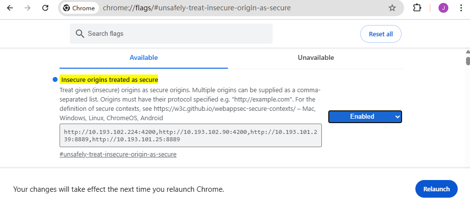

Then, click the `Scan QR Code` and `Start Scan` buttons. A windows will pop up. Please chose the "Allow while visiting the site" for camera permission for QR Code scanning. 


After scanning the QRCode, the web interface will update the `QRcode` input field. Then, enter the `Device ID` and `Device Alias` and click the `Send Command` to pairing device by QRCode. The following command will be triggered to commission the device:

```
$ chip-tool pairing code <node_id> <payload>
```
In this command:

-   _<node_id\>_ is the user-defined device ID of the node being commissioned.
-   _<payload\>_ is the scanned QR Code, or enter the payload by yourself.

> **Note:** The QRCode Scan only support on Chrome in Windows or Android, not support on iOS since the iOS cant set the chrome://flags.

<hr>

<a name="list"></a>

## List commissioned devices in chip-tool-web2

Once the pairing process is complete, the Matter device is successfully commissioned to the network. Click `Devices` button in the sidebar to see all the commissioned devices. The device card will show the node alias("Lighting", shown below), the device ID ("8888", shown below) and the endpoint information ("Matter Dimmable Light" cluster of endpoint ID 1).

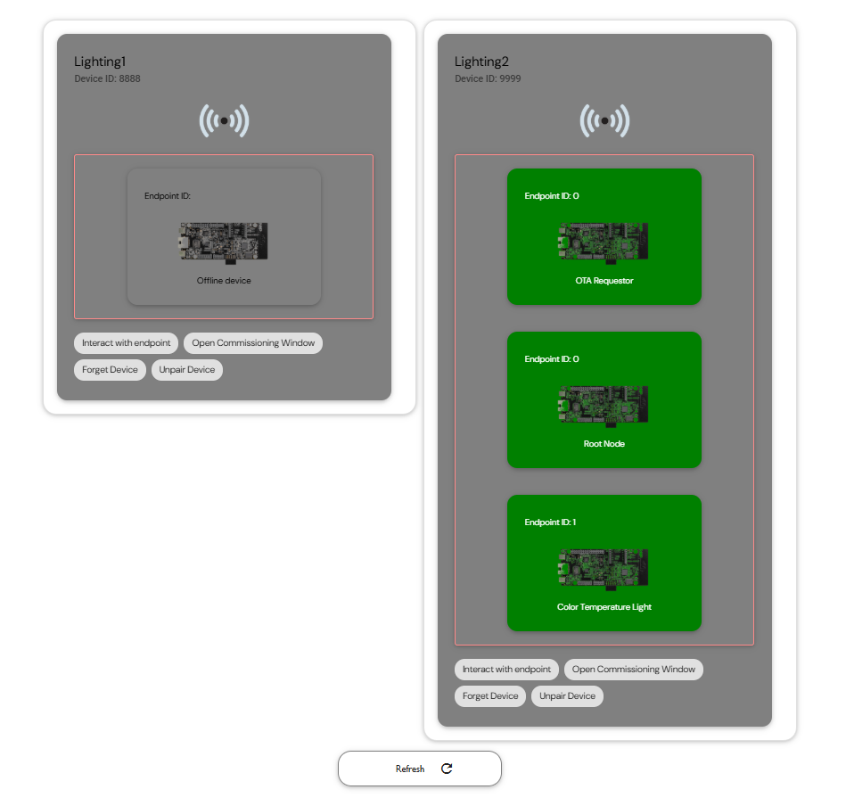

### Interact with lighting device

Click the `Interact with endpoint`, and enter `Endpoint ID`, and then select `ON`, `OFF`, `Toggle` or `Read` to interact with the lighting device.

-   Use the `ON` button to trigger the following command to turn on the state of the OnOff attribute:
    ```
    $ chip-tool onoff on <node_id> <endpoint_id>
    ```
-   Use the `OFF` button to trigger the following command to turn off the state of the OnOff attribute:
    ```
    $ chip-tool onoff off <node_id> <endpoint_id>
    ```
-   Use the `Toggle` button to trigger the following command to toggle the state of the OnOff attribute:
    ```
    $ chip-tool onoff toggle <node_id> <endpoint_id>
    ```
-   Use the `Read` button to trigger the following command to read the state of the OnOff attribute:
    ```
    $ chip-tool onoff read on-off <node_id> <endpoint_id>
    ```
    In above commands:

    -   _<node_id\>_ is the user-defined device ID of the commissioned node.
    -   _<endpoint_id\>_ is the ID of the endpoint with OnOff cluster implemented.

### Open Commissioning Window

For the open commissioningg window, please refer to the [multi-admin](#multiadmin) section.

<hr>

<a name="subscription"></a>

## Subscription of Matter device OnOff cluster in chip-tool-web2

Subscribing to an attribute lets you mirror the state of the attribute as it changes in the Matter network. Chip-tool-web2 support for subscribing to the `on-off` attribute of the `onoff` cluster. Click the `Subscriptions` button in sidebar to see all the commissioned devices, click the `Subscibe to device` in device card, enter the `Endpoint ID`, `Subscription Min Interval`, `Subscription Max Interval`. Select `Cluster ON/OFF` and then click `Subscribe` button to trigger the subscribe command. 

```
$ chip-tool onoff subscribe on-off <min-interval> <max-interval> <node_id> <endpoint_id>
```
In this command:

- _<min-interval\>_ specifies the minimum number of seconds that must elapse since the last report for the server to send a new report.
- _<max-interval\>_ specifies the number of seconds that must elapse since the last report for the server to send a new report.
- _<node-id\>_ is the user-defined device ID of the commissioned node.
- _<endpoint_id\>_ is the ID of the endpoint where the `onoff` cluster is implemented.

> **Note:** Because subscribe must maintain the subscription status in interactive mode, please do not enter any other commands in the console of the i.MX Matter devices when the chip-tool-web2 initiates the subscribe command, as this may interrupt the update of the subscribe report.

The subscription information will appear at the bottom of the interface as shown below:

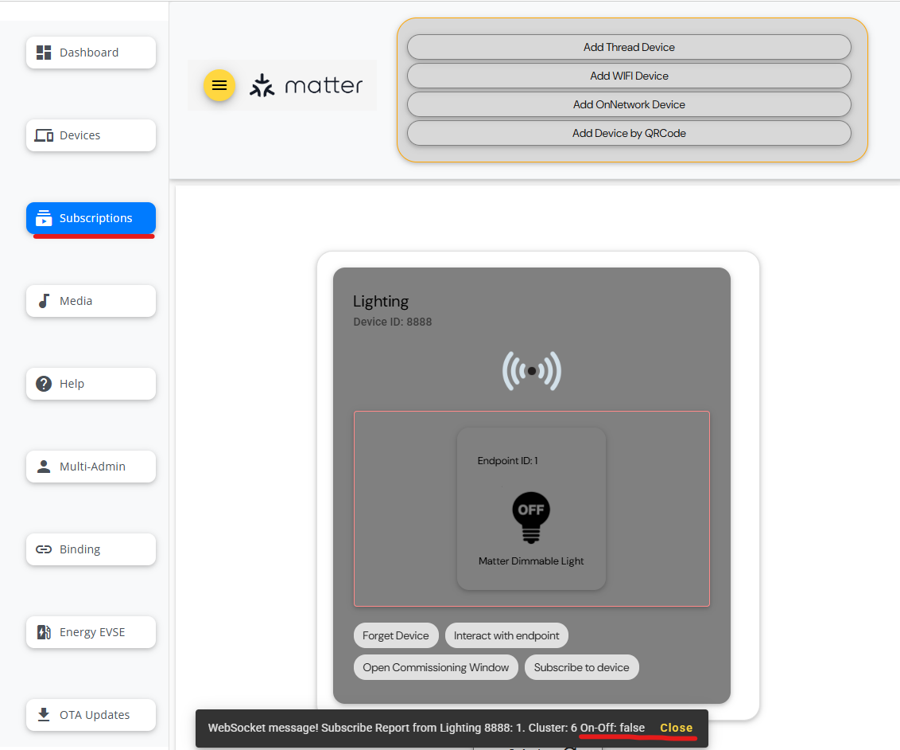

<hr>

<a name="media"></a>

## Controlling a Matter device mediaplayback cluster

The i.MX Matter supports the nxp-media-app from the 2023 q4 release. You can use chip-tool-web2 to control the media player and read information.
Click the `Media` button in the sidebar. The following interface will be displayed:

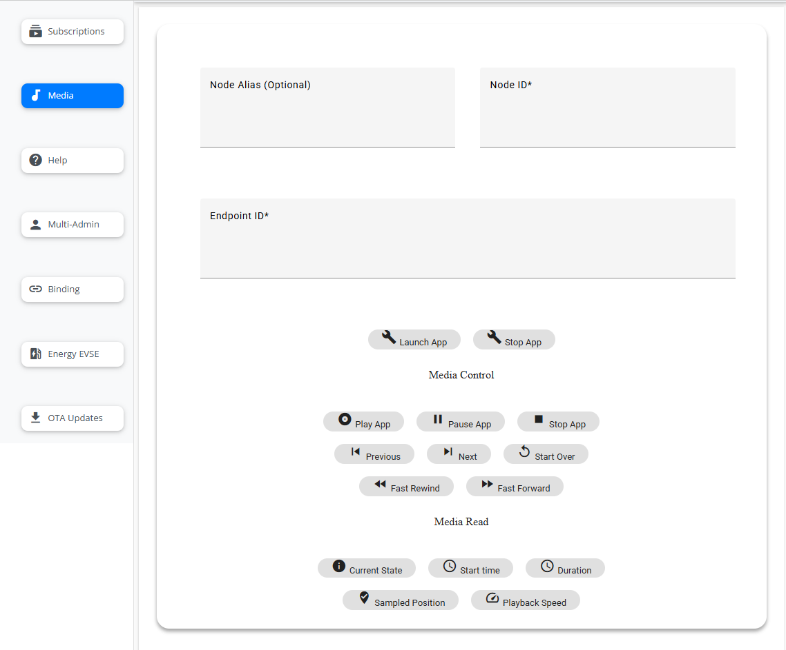

> **Note:** Before controlling media app, you need to place media files in the `/home/root/media` folder of device which running the nxp-media-app.

### Launch or Stop app

Enter the `Node Alias (Optional)`, `Node ID`, and `Endpoint ID`. Then, you can click the `Launch APP` or `Stop APP` button to launch or stop the app.

### Media Control

Enter the `Node Alias (Optional)`, `Node ID`, and `Endpoint ID`. Then, use the following buttons in the `Media Control` section to control the status of the `mediaplayback` attribute:

-   Use the `Play APP` button to trigger the following command to change the current media playback state to play:
    ```
    $ chip-tool mediaplayback play <node_id> <endpoint_id>
    ```
-   Use the `Pause APP` button to trigger the following command to change the current media playback state to pause:
    ```
    $ chip-tool mediaplayback pause <node_id> <endpoint_id>
    ```
-   Use the `Stop APP` button to trigger the following command to change the current media playback state to stop:
    ```
    $ chip-tool mediaplayback stop <node_id> <endpoint_id>
    ```
-   Use the `Previous` button to trigger the following command to play privious media:
    ```
    $ chip-tool mediaplayback privious <node_id> <endpoint_id>
    ```
-   Use the `Next` button to trigger the following command to play next media:
    ```
    $ chip-tool mediaplayback next <node_id> <endpoint_id>
    ```
-   Use the `Start Over` button to trigger the following command to start over the media being played:
    ```
    $ chip-tool mediaplayback start-over <node_id> <endpoint_id>
    ```
-   Use the `Fast Rewind` button to trigger the following command to rewind the current media, and then you can use the `PLAY` button to play the rewinded media:
    ```
    $ chip-tool mediaplayback rewind <node_id> <endpoint_id>
    ```
-   Use the `Fast Forward` button to trigger the following command to fast forward the current media:
    ```
    $ chip-tool mediaplayback fast-forward <node_id> <endpoint_id>
    ```
    In above commands:

    -   _<node_id\>_ is the user-defined ID of the commissioned node.
    -   _<endpoint_id\>_ is the ID of the endpoint with `mediaplayback` cluster implemented.

### Media Status

Enter the `Node Alias (Optional)`, `Node ID`, and `Endpoint ID`. Then, use the following buttons to read the status of the `mediaplayback` attribute in the `Media Read` section.

-   Use the `Current State` button to trigger the following command to read the current state of media playback:
    ```
    $ chip-tool mediaplayback read current-state <node_id> <endpoint_id>
    ```
-   Use the `Start time` button to trigger the following command to read the start time of the currently playing media:
    ```
    $ chip-tool mediaplayback read start-time <node_id> <endpoint_id>
    ```
-   Use the `Duration` button to trigger the following command to read the duration of the currently playing media:
    ```
    $ chip-tool mediaplayback read duration <node_id> <endpoint_id>
    ```
-   Use the `Sampled Position` button to trigger the following command to read current sampled position playback speed of the currently playing media:
    ```
    $ chip-tool mediaplayback read sampled-position <node_id> <endpoint_id>
    ```
-   Use the `Playback Speed` button to trigger the following command to read the playback speed of the currently playing media:
    ```
    $ chip-tool mediaplayback read playback-speed <node_id> <endpoint_id>
    ```
In above commands:

-   _<node_id\>_ is the user-defined ID of the commissioned node.
-   _<endpoint_id\>_ is the ID of the endpoint with mediaplayback cluster implemented.

#### Report Format

The media read report is output in text format with the following structure:
```
Report from ${nodealias} ${nodeid}:${endpoint}. Cluster:${cluster}
${attribute}:${value}
```
In the structure above,

- ${nodealias}: The node alias of the device.
- ${nodeid}: The nodeid of the device.
- ${endpoint}: The endpoint of the device.
- ${cluster}: The cluster name to which the device belongs.
- ${attribute}: The name of the attribute being reported. In this case, the default attributes are `CurrentState`, `StartTime`, `Duration`, `Sampled Position`, `PlatbackSpeed`.
- ${value}: The value of the attribute. There are three possible values for `CurrentState`: `Play`, `Pause`, `Stop`. The value of start time is always `0`. The value of `Duration` is currently playing media's duration. There are five possible values for `PlatbackSpeed`: `1.000000`, `2.000000`, `4.000000`, `8.000000`, `10.000000`.

<hr>

<a name="binding"></a>

## Binding for light and switch Matter device

Binding describes a relationship between the device that contains the binding cluster and the end device. The chip-tool-web2 supports binding a light in one light_switch_combo device to the switch in another light_switch_combo device, allowing the light in another device to be controlled by the switch of one device.

To access the `Binding` function in the chip-tool-web2, click `Binding` button on sidebar. The following interface will be displayed:

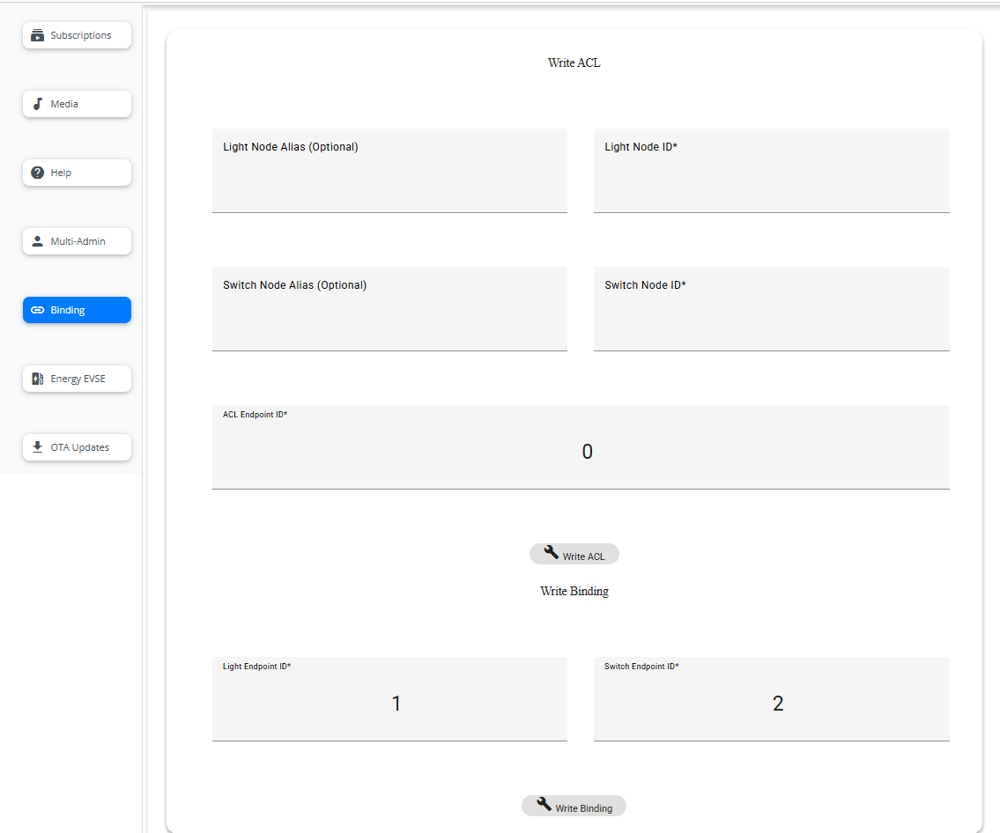

### Write ACL

First, the light_switch_combo application should run properly on the K32W Matter device, and then use the chip-tool-web2 ble-thread pairing method to commission with two light_switch_combo devices separately.

Two light-switch_combo devices, one used as the switch device and the other used as the light device. Before binding, the access control list must be written. Therefore, in the `Write ACL` section, enter the `Lighting Node Alias (Options)`, `Lighting Node ID` of the light_switch_combo device which play as lighting device, enter the `Switch Node Alias (Options)`, `Switch Node ID` of the light_switch_combo device which play as switch device, `ACL EndPoint ID` is recommended to use endpoint `0`. Then click the `Write ACL` button to trigger write acl command like below.
```
chip-tool accesscontrol write acl <acl_data> <node_id> <endpoint_id>
```
In this command:

-   _<acl_data\>_ is the ACL data formatted as a JSON array. Here is the `'[{"fabricIndex": 1, "privilege": 5, "authMode": 2, "subjects": [112233], "targets": null },{"fabricIndex": 1, "privilege": 3, "authMode": 2, "subjects": [<Switch Node Id>], "targets": null }]'`.
-   _<node_id\>_ is the ID of the node that is going to receive ACL. Here is <Light node ID\>.
-   _<endpoint_id\>_ is the ID of the endpoint on which the `accesscontrol`
    cluster is implemented. 0 means all endpoints.

For more details, you can refer to [access control guide](https://github.com/project-chip/connectedhomeip/blob/master/docs/guides/access-control-guide.md).

### Write Binding

After trigger the write access list command, you can click the `Write Binding` button to binding the Light and Switch device，it will trigger the command:
```
$ chip-tool binding write binding <binding_data> <node_id> <endpoint_id>
```
In this command:

-   _<binding_data\>_ is the binding data formatted as a JSON array. Here is `[{"fabricIndex": 1, "node": <Light NodeId>, "endpoint": <Light EndPoint ID>, "cluster": 6}]'`.
-   _<node_id\>_ is the ID of the node that is going to receive the binding. Here is <Switch node ID\>.
-   _<endpoint_id\>_ is the ID of the endpoint on which the `binding` cluster is
    implemented. Here is the <Switch EndPoint ID\> of the switch device.

After the binding command is successfully executed, press SW2 two times on the device acting as Switch to register the binding entry, and then you can control the light (D3) on the peer device (light device) just by pressing SW2/SW3.

<hr>

<a name="multiadmin"></a>

## Opening the commissioning window for the commissioned Matter device

Multi-admin feature allows you to join Matter device to multiple Matter fabrics and have multiple different Matter administrators administer it. Chip-tool-web2 supports the Basic Commissioning Method (BCM) and Enhanced Commission Method (ECM) to open the commissioning window of i.MX Matter device for a new administrator from another fabric.

Click the `Multi-Admin` button in sidebar, the following interface will be displayed:

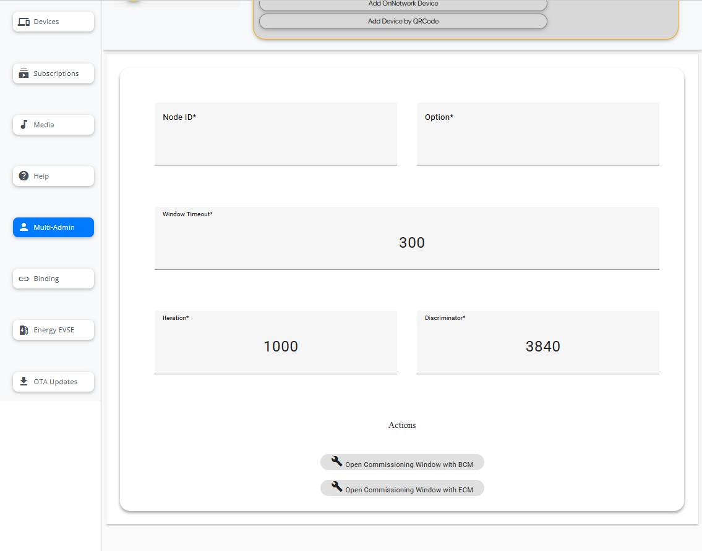

Enter `Node ID`, `Option`, `Window Timeout`, `Iteration` and `Discriminator`. Then, click `Open Commissioning Window with BCM` (when `Option` is 0) or `Open Commissioning Window with ECM` (when `Option` is 1) button to trigger the Open Commissioning window:
```
$ chip-tool pairing open-commissioning-window <node_id> <option> <window_timeout> <iteration> <discriminator>
```
In this command:

-   _<node_id\>_ is the ID of the node that should open commissioning window.
-   _<option\>_ is equal to `0` for BCM and `1` for ECM.
-   _<window_timeout\>_ is time in seconds, before the commissioning window closes.
-   _<iteration\>_ is number of PBKDF iterations to use to derive the PAKE verifier.
-   _<discriminator\>_ is device specific discriminator determined during commissioning.

When using the ECM, there will show a manul pairing code and QRCode like below in web interface. Then you can add this device on another administrator by [`Add Device by QRCode`](#add_qrcode). 

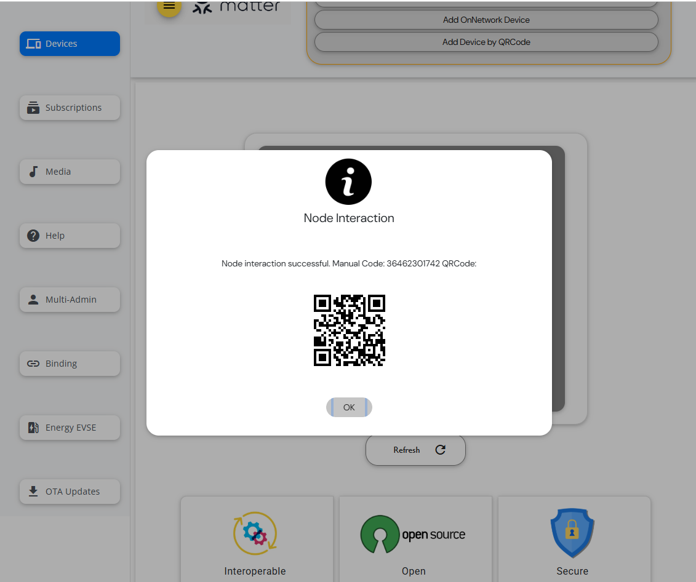

Besides, you can then commission the Matter device to a new fabric using another instance of the CHIP tool by below command.
```
$ chip-tool pairing code <node_id> <payload>
```
In this command:

-   _<node_id\>_ is the user-defined device ID of the commissioned node.
-   _<payload\>_ is the QR code payload or a manual pairing code generated by the first commissioner instance when opened commissioning window. If you used the BCM to open commissioning window, the manual pairing code should be `34970112332`.

<hr>

<a name="eevse"></a>

## Controlling a Matter device Energy EVSE Cluster

***Note: To perform EEVSE control related operations on the chip-tool-web2, relevant parameters must be added. For example, run the application with the command "$chip-energy-management-app --enable-key 000102030405060708090a0b0c0d0e0f", and then perform the onnetwork pairing operation on the chip-tool-web2.***

Once the pairing process is complete, the Matter device is successfully commissioned to the network. For the chip-energy-management-app, the EEVSE clusters are implemented in chip-tool-web2, allowing you to control the end devices using the `energyevse` cluster commands.

To access the `energyevse` function in the chip-tool-web2, click the `Energy EVSE` button in the sidebar. The following interface will be displayed:

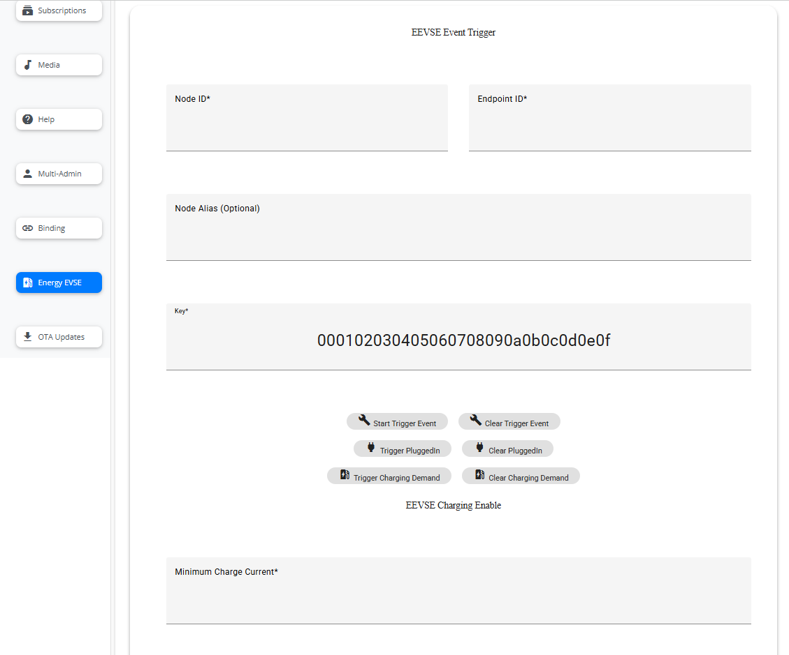

### Event Trigger

Enter the `Node Alias (Optional)`, `Node ID`, and `Endpoint ID` of the commissioned Matter chip-energy-management-app device, then click the `TRIGGER`s or `CLEAR`s button to trigger or clear the simulated event. 

- The `Start Trigger Event` button is used to simulate a start event as the basis for triggering subsequent simulated events.
- The `Trigger PluggedIn` button is used to simulate a plugged-in event. Indicates that electric vehicles is connected to the charging station. This event must be triggered after a start event has been triggered.
- The `Trigger Charging Demand` button is used to simulate a charging demand event. Indicates that electric vehicles have a charging requirement. This event must be triggered after a plugged-in event has been triggered.
- The `Clear Trigger Event` button is used to clear the simulated start event.
- The `Clear PluggedIn` button is used to clear the simulated pluggedin event.
- The `Clear Charging Demand` button is used to clear the simulated charging demand event.

When simulating events, the principle of "last trigger, first clear" should be used, e.g. the order should be: `Start Trigger Event` -- `Trigger PluggedIn` -- `Trigger Charging Demand` -- `Clear Charging Demand` -- `Clear PluggedIn` -- `Clear Trigger Event`

### Charging Enable

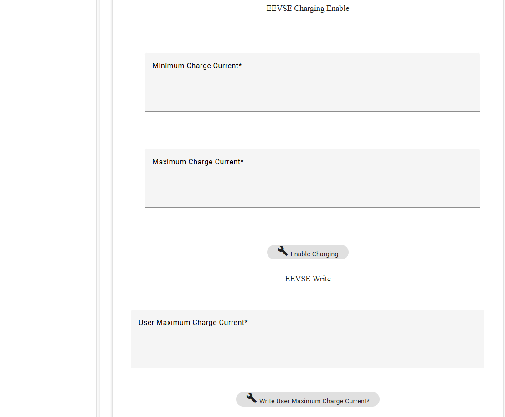

After the simulated charging demand event is triggered. Enter the value of `Minimum Charge Current` and `Maximum Charge Current`, and click the `Enable Charging` button to start charging by below commands.

```
$ chip-tool energyevse enable-charging null <minimum_charge_current> <maximum_charge_current> <node_id> <endpoint_id> --timedInteractionTimeoutMs 3000
```
In this command:
- _<minimum_charge_current\>_ is the minimum charge current(mA).
- _<maximum_charge_current\>_ is the maximum charge current(mA).
- _<node_id\>_ is the user-defined ID of the commissioned node.
- _<endpoint_id\>_ is the ID of the endpoint with energyevse cluster implemented.

### EEVSE Write

Enter the value of `User Maximum Charge Current` and click the `Write User Maximum Charge Current` button to set user-maximum-charge-current sttribute value by below commands.
```
chip-tool energyevse write <user_maximum_charge_current> <node_id> <endpoint_id>
```
In this command:
- _<user_maximum_charge_current>_ is the user-defined maximum charge current(mA).

### EEVSE Charging Disable

Click the `Disable Charging` button to disable charging value by below commands.
```
chip-tool energyevse disable <node_id> <endpoint_id> --timedInteractionTimeoutMs 3000
```

### EEVSE Status

Use the following buttons to read the status of the `energyevse` attribute in the `EEVSE Status` section. The page is shown below:


-   Use the `State` button to trigger the following command to read the state of energyevse:
    ```
    $ chip-tool energyevse read state <node_id> <endpoint_id>
    ```
-   Use the `Supply State` button to trigger the following command to read the supply-state of energyevse:
    ```
    $ chip-tool energyevse read supply-state <node_id> <endpoint_id>
    ```
-   Use the `Fault State` button to trigger the following command to read the fault-state of energyevse:
    ```
    $ chip-tool energyevse read fault-state <node_id> <endpoint_id>
    ```
-   Use the `Charging Enabled Until` button to trigger the following command to read the charging-enabled-until of tenergyevse:
    ```
    $ chip-tool energyevse read charging-enabled-until <node_id> <endpoint_id>
    ```
-   Use the `Minimum Charge Current` button to trigger the following command to read the minimum-charge-current of energyevse:
    ```
    $ chip-tool energyevse read minimum-charge-current <node_id> <endpoint_id>
    ```
-   Use the `Maximum Charge Current` button to trigger the following command to read the maximum-charge-current of energyevse:
    ```
    $ chip-tool energyevse read maximum-charge-current <node_id> <endpoint_id>
    ```
-   Use the `Session ID` button to trigger the following command to read the session-id of energyevse:
    ```
    $ chip-tool energyevse read session-id <node_id> <endpoint_id>
    ```
-   Use the `Session Duration` button to trigger the following command to read the session-duration of energyevse:
    ```
    $ chip-tool energyevse read session-duration <node_id> <endpoint_id>
    ```

#### Report Format

The EEVSE read report is output in text format with the following structure:
```
Report from ${nodealias} ${nodeid}:${endpoint}. Cluster:${cluster}
${attribute}:${value}
```
In the structure above,

- ${nodealias}: The node alias of the device.
- ${nodeid}: The nodeid of the device.
- ${endpoint}: The endpoint of the device.
- ${cluster}: The cluster name to which the device belongs.
- ${attribute}: The name of the attribute being reported. In this case, the default attributes are `state`, `supplystate`, `faultstate`, `chargingenableduntil`, `minimumchargecurrent`, `maximumchargecurrent`, `sessionid`, `sessionduration`.
- ${value}: The value of the attribute.

<hr>

<a name="ota"></a>

## OTA updates on chip-tool-web2

The chip-tool-web2 supports uploading OTA file and controlling OTA processing. Click the `OTA Updates` in sidebar, the following page will display:

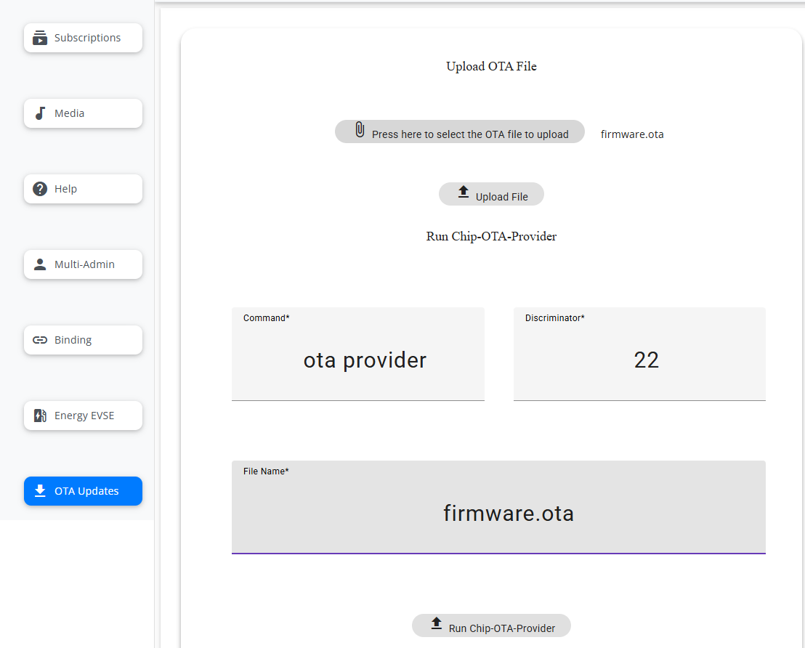

The OTA processing includes seven steps. Please follow the steps below strictly to perform the OTA process.

### Step 1 Upload OTA file

Click the "Press here to select the OTA file to upload" button to select the OTA file from your browser's running system. Then, click `Upload File` to upload the OTA file.

### Step 2 Run chip-ota-provider-app

Enter the `File name` and click the `Run Chip-OTA-Provider` button to run the chip-ota-provider-app on the chip-tool-web2 running i.MX controller device. Make sure the pop-up information “OTA Report: chip-ota-provider-app start successfully” shows that the chip-ota-provider-app started successfully.

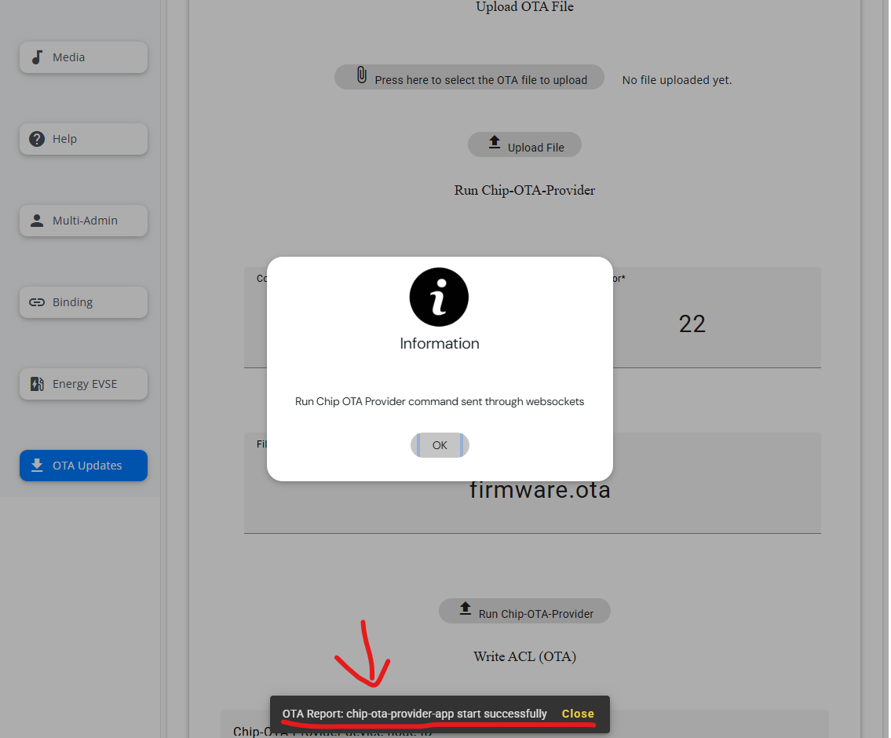

### Step 3 Commissioning with chip-ota-provider-app

Commissioning with chip-ota-provider-app in chip-tool-web2 by selecting `Add OnNetwork Device`.

### Step 4 Run chip-ota-requestor-app in the end devices

Run the chip-ota-requestor-app on the another device. Refer to [chip-ota-request request processing](./nxp_mpu_matter_demos.md#ota_request).

### Step 5 Commissioning with chip-ota-requestor-app

Commissioning with chip-ota-provider-app in chip-tool-web2 by selecting `Add OnNetwork Device`.

### Step 6 Write ACL

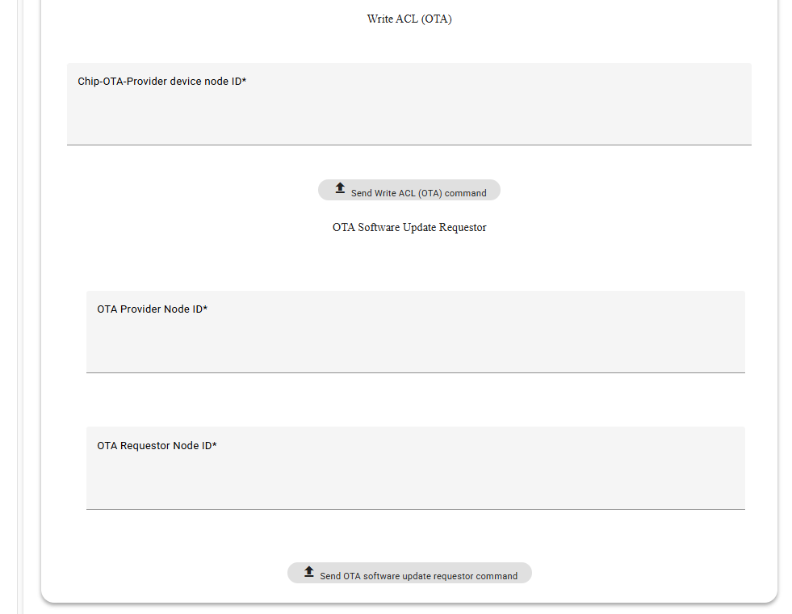

Enter the `Chip-OTA-Provider device node ID` and click `Send Write ACL (OTA) command` in the `Write ACL (OTA)` section to start the write ACL processing.

### Step 7 Send OTA command

Enter the `OTA Provider Node ID` and `OTA Requestor Node ID`, then click the `Send OTA software update requestor command` button to start the OTA processing.
Please notice the pop-up information "OTA Report: chip-ota-provider-app ota transfer successfully" to confirm that the OTA process has finished.

After completing the OTA process, [check the OTA processing on the end device](./nxp_mpu_matter_demos.md#ota_check).

<hr>

<a name="note"></a>

## Additional Notes

- Deleting the `/tmp/chip_tool_config.ini` file and any other `.ini` files in the `/tmp` directory may help to resolve problems caused by outdated configuration.
Running `rm -rf /tmp/chip_*` will remove these files. This will allow the chip-tool-web2 to rebuild its configuration files from scratch.

- The timeout for buttons in the chip-tool-web2 that execute commands is set to default timeout, e.g. 125 seconds for pairing buttons and 20 seconds for cluster read buttons. During the command execution process, the interface will display the command execution waiting effect. Please wait patiently for the command to finish executing and return a result of `success` or `failed`.

- In general, commands related to `Pairing` may take longer to execute, while commands related to `OnOff` functionality will execute faster. If a pairing command takes a long time to execute and returns with `failed`, please check that the device configuration follows the [documentation](./nxp_mpu_matter_demos.md). Also, try pairing again after running `rm -rf /tmp/chip_*`.

- The chip-tool-web2 supports commissioning multiple devices at the same time. Note that you should not run `rm -rf /tmp/chip_*` while commissioning multiple devices at once, as this will erase the useful information of the successfully paired devices.

- The chip-tool-web2 only supports commissioning devices with a decimal node ID, not a hexadecimal one.

- New features are still being developed and expanded.