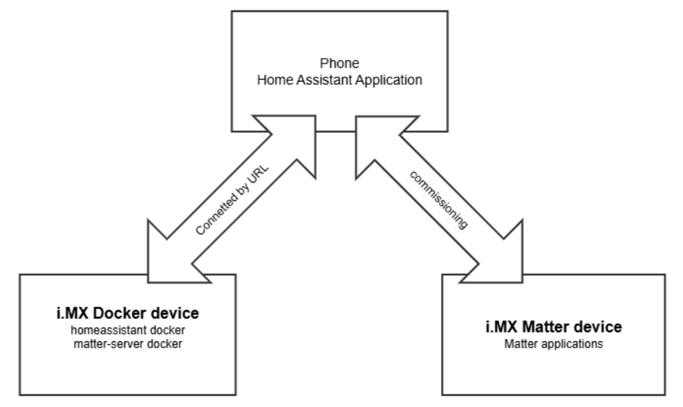
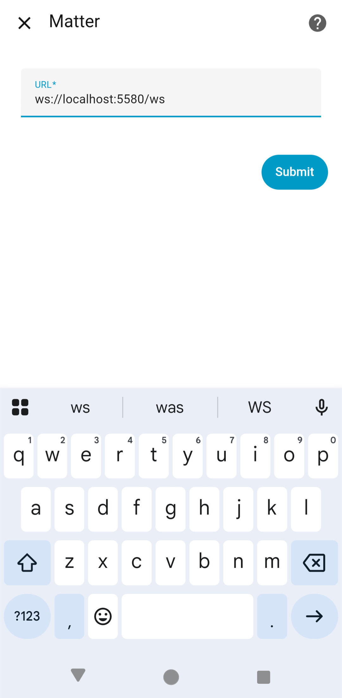
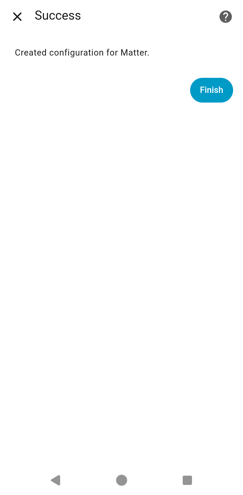
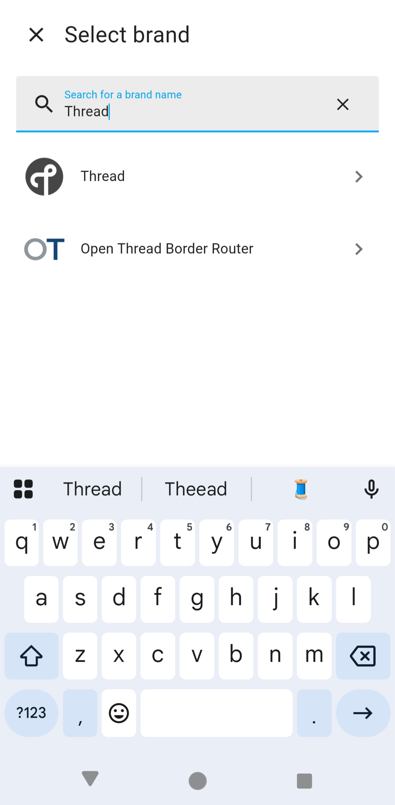
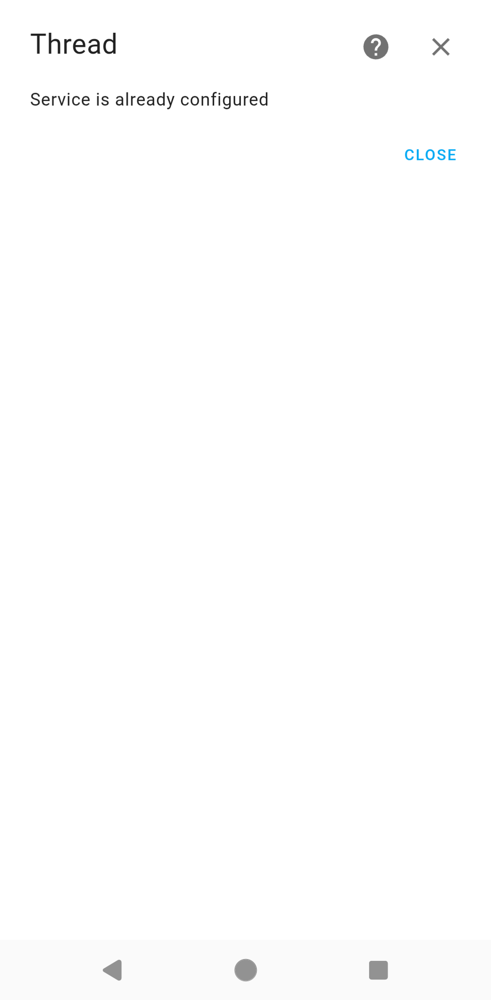
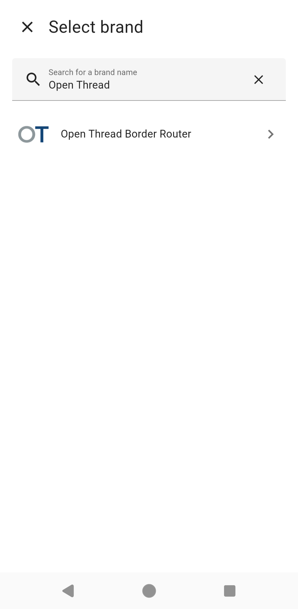
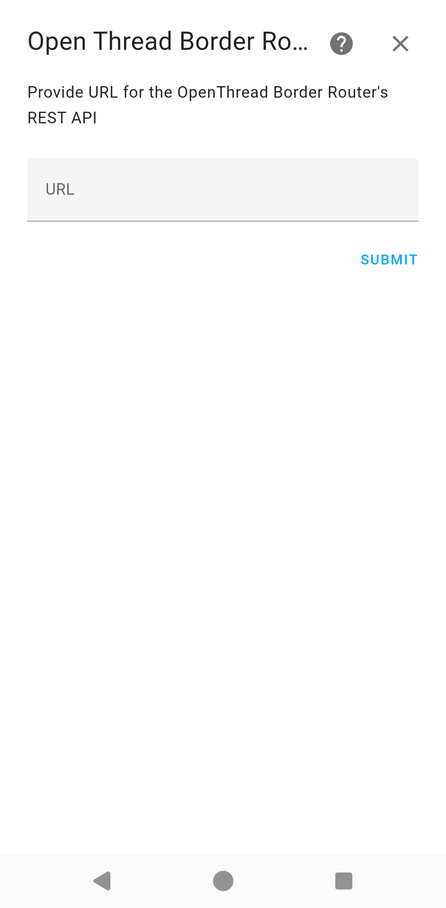
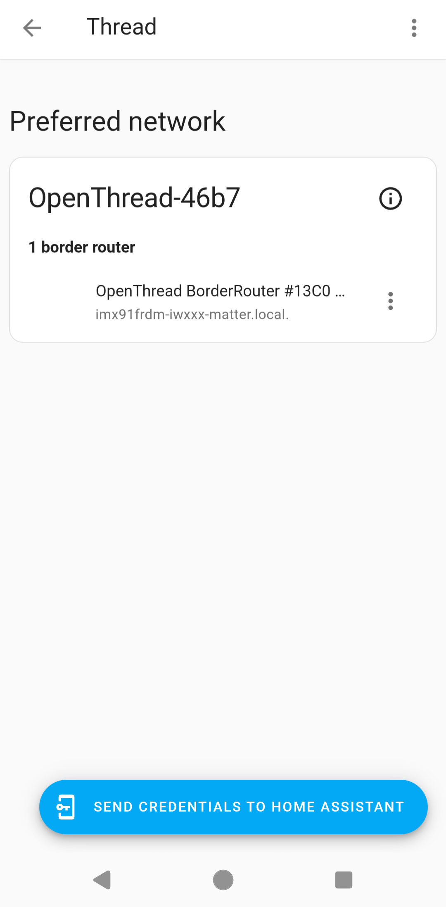
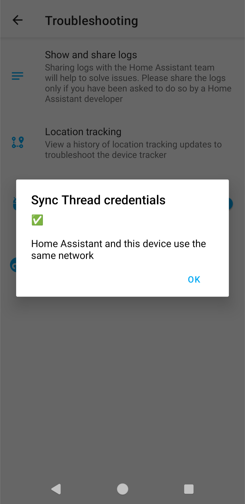

# Running Matter Commissioning in Home Assistant application on i.MX MPU platforms

The [Home Assistant](https://www.home-assistant.io/) (HA) application runs on both Android and iOS systems. By deploying the Home Assistant and Matter Server Docker containers on the i.MX MPU platform, you can use the HA application on the phone to manage Matter devices intuitively and easily. This document shows how to deploy the Home Assistant and Matter Server Docker containers on i.MX MPU platforms and then shows how to commission i.MX Matter devices in the HA application.

 [**Overview**](#overview)

 [**Deploying the Docker containers on the i.MX MPU platform**](#deploy-docker)

 [**Running the Home Assistant application on the Phone**](#running-app)

 [**Commissioning the i.MX Matter device on Home Assistant application**](#commissioning-with-phone)

 [**Known issue**](#known-issue)

 [**FAQ**](#faq)

## Overview

The i.MX MPU platforms support deploying the HA and matter-server Docker containers. As shown in the figure below, by deploying Docker containers on an i.MX device, the i.MX device becomes the HA server, and the HA application can access the HA server via URL. You can then perform the commissioning.

 

Figure. HA schematic diagram for i.MX MPU platform

## Deploying the Docker containers on the i.MX MPU platform

You should first download and deploy the Docker containers on an i.MX MPU platform.

Download and deploy the homeassistant and matter-server Docker images.

    $ docker run -d --name homeassistant --privileged --restart=unless-stopped -e TZ=MY_TIME_ZONE -v $(pwd)/config:/config -v /run/dbus:/run/dbus:ro --network=host ghcr.io/home-assistant/home-assistant:2025.11
    $ docker run -d --name matter-server --restart=unless-stopped --security-opt apparmor=unconfined -v $(pwd)/data:/data --network=host ghcr.io/home-assistant-libs/python-matter-server:8.1.0 --storage-path /data --paa-root-cert-dir /data/credentials

It will take a few minutes to download and deploy the images. You can check the images by running "$ docker image" after the deployment is complete.

    root@cn-szh02-ns-pr002:~# docker images
    REPOSITORY                                         TAG       IMAGE ID       CREATED        SIZE
    ghcr.io/home-assistant/home-assistant              2025.11   3e56abf51c1e   6 days ago     2.06GB
    ghcr.io/home-assistant-libs/python-matter-server   8.1.0     974a0e20775e   3 months ago   462MB

## Running the Home Assistant application on the Phone

Before running the HA application, you need to perform some environmental configuration.
First, you can use the commands below to connect to the Wi-Fi AP on the i.MX Docker device and check its IP address.

    $ wpa_passphrase ${SSID} ${PASSWORD} > wifiap.conf

    $ ifconfig eth0 down
    $ modprobe moal mod_para=nxp/wifi_mod_para.conf
    $ wpa_supplicant -d -B -i mlan0 -c ./wifiap.conf
    $ sleep 5
    $ modprobe btnxpuart
    $ hciconfig hci0 up

    $ ifconfig mlan0       # check IP address

If you need to commission a Thread device in HA, please [setup OTBR on the i.MX Docker device](.nxp_mpu_matter_demos.md#matter-demos-with-otbr)

Then, connect to the same Wi-Fi AP, enable Bluetooth on your phone, and open the HA app on your phone and configure the HA server URL.

If you are a new user of this application, you can set the URL when you log in to this application. Enter the URL and click the "Connect" button. The URL should be in the format  `http://<IP_ADDRESS>:8123 `, where <IP_ADDRESS> is the IP address of your i.MX device.

 

Figure. Configuring the Home Assistant server URL when logging in

Or you can configure the URL in the settings according to the below steps, click the "SETTINGS", "Home", "Home Assistant URL" buttons in sequence on the following page to update the URL.

  

Figure. Configuring the Home Assistant server URL in Settings

Once you have connected the Home Assistant server, you should integrate the Python Matter server to communicate with the i.MX Matter device. You will also need to integrate the Thread and OpenThread Border Router server if you need to commission the Matter Thread device.

Integrate the Python Matter server into the Phone application:

Click on "Setting" – "Devices & services" – "+ Add integration" at the bottom right corner – search for "Matter" – slelect the "Matter" – enter URL "ws://localhost:5580/ws" – "Submit" to integrate Python Matter Server.

Figure. Integrate the Python Matter server

Integrate the Thread service into the HA instance:

Click on "Setting" – "Devices & services" – "+ Add integration" at the bottom right corner – search for "Thread" - select the "Thread" . The Thread service will be added to HA instance as shown below.

Figure. Integrate the Thread service

Integrate the Open Thread Border Router REST API into HA instance:

Click on "Setting" – "Devices & services" – "+ Add integration" at the bottom right corner - search for "Open Thread Border Router" - select the "Open Thread Border Router" – Enter URL "http://ip:8081" (IP is the otbr-agent device's IP, it uses 8081 port for REST API by default) – Submit, the Open Thread Border Router REST API will add into HA instance.

Figure. Integrate the Thread Border Router

Set the preferred network and sync Thread credentials

Go to "Setting" - "Devices & services" - "Thread" - click the configurtion logo - set or check the right border router as preferred network.
Then, go to "Setting" – "Companion app" – "Troubleshooting" – "Sync Thread credentials" to Sync the credentials.

Figure. Setting the preferred network and sync the Thread credentials.

## Commissioning the i.MX Matter device on Home Assistant application

This chapter shows how to commission an i.MX Matter device on HA application.

First, set up the i.MX Matter device. There are two ways to run the Matter application. Take the chip-lighting-app as an example. You can also setup the Matter application on a Thread device.

Please run the commands below if the i.MX Matter device is i.MX93 or i.MX91 to enable the ELE. For other boards, proceed to Option 1 or Option 2.

    $ systemctl enable nvm_daemon
    $ systemctl start nvm_daemon
    $ systemctl status nvm_daemon # make sure the daemon active and running.

Option 1

    $ wpa_passphrase ${SSID} ${PASSWORD} > wifiap.conf
    $ ifconfig eth0 down
    $ ifconfig eth1 down
    $ modprobe moal mod_para=nxp/wifi_mod_para.conf
    $ wpa_supplicant -d -B -i mlan0 -c ./wifiap.conf
    $ sleep 5
    $ modprobe btnxpuart
    $ hciconfig hci0 up
    $ chip-lighting-app

Option 2

    $ ifconfig eth0 down
    $ ifconfig eth1 down
    $ modprobe moal mod_para=nxp/wifi_mod_para.conf
    $ modprobe btnxpuart
    $ hciconfig hci0 up
    $ chip-lighting-app --wifi --ble-device 0

After running chip-lighting-app, you will find a log line similar to the one below, copy the URL and open it in a browser, you can see the QR code of this Matter application.

    CHIP:SVR: https://project-chip.github.io/connectedhomeip/qrcode.html?data=MT%3A-24J042C00KA0648G00

Then, you can commission i.MX Matter application as shown in the following pictures. Click the "Settings", "Devices & services", "+ Add integration", "Add Matter device", "No, it's new.", "Open camera here" buttons in sequence on the following pages to start scanning the QR code of the i.MX Matter application.

     

Figure. How to start the commissioning on the phone app

Once the QR code is scanned, it goes through the following processes to connect to the i.MX Matter application chip-lighting-app.

   

Figure. Device connection procedure

Once the device has been successfully connected, you will be able to control it.

## Known issue

- When commissioning with the chip-all-cluster-app, you may encounter a "Something went wrong" error in the final steps of the commissioning process on the Home Assistant app. This is a known issue related to the Home Assistant Docker environment.

## FAQ

### What to do if the download fails or the download speed of the Docker image is very slow?

The download failure or slow download speed may be caused by network issues. Please use the following commands to set the proxies for the Docker service. Then retry to download and deploy the Docker image again.

    $ mkdir /etc/systemd/system/docker.service.d
    $ vi /etc/systemd/system/docker.service.d/http-proxy.conf
        [Service]
        Environment="HTTP_PROXY=${YOUR_HTTP_PROXY_URL}:${YOUR_HTTP_PROXY_PORT}"
        Environment="HTTPS_PROXY=${YOUR_HTTPS_PROXY_URL}:${YOUR_HTTPS_PROXY_PORT}"
        Environment="NO_PROXY=localhost,127.0.0.*,${YOUR_HOST_network_prefix}.*"

    $ systemctl daemon-reload
    $ systemctl restart docker

### What to do if the commissioning fails?

Please check the status of the Docker service, as well as the network status and the status of the Bluetooth interface.

    $ systemctl status docker    # check the Docker service status
    $ systemctl start docker     # start the Docker service
    $ ifconfig mlan0             # check the Network status
    $ hciconfig hci0             # check the Bluetooth status

You need to make sure that the Docker service is active, an IP has been assigned to the mlan0 interface, and that hci0 is up and running.

        root@imx93evk-iwxxx-matter:~# systemctl status docker
        * docker.service - Docker Application Container Engine
            Loaded: loaded (8;;file://imx93evk-iwxxx-matter/usr/lib/systemd/system/docker.service/usr/lib/systemd/system/docker.service8;;; disabled; preset: disabled)8;;
            Active: active (running) since Tue 2024-10-22 07:09:36 UTC; 36s ago
        TriggeredBy: * docker.socket
            Docs: 8;;https://docs.docker.comhttps://docs.docker.com8;;8;;
        Main PID: 681 (dockerd)
            Tasks: 12
            Memory: 98.1M (peak: 100.0M)
                CPU: 1.345s
            CGroup: /system.slice/docker.service
                `-681 /usr/bin/dockerd -H fd:// --containerd=/run/containerd/containerd.sock

        root@imx93evk-iwxxx-matter:~# ifconfig mlan0

        mlan0: flags=4163<UP,BROADCAST,RUNNING,MULTICAST>  mtu 1500
        inet 192.168.3.119  netmask 255.255.254.0  broadcast 192.168.3.255
        inet6 2001:470:11e:f:a2cd:f3ff:fe77:e72e  prefixlen 64  scopeid 0x0<global>
        inet6 fe80::a2cd:f3ff:fe77:e72e  prefixlen 64  scopeid 0x20<link>
        ether a0:cd:f3:77:e7:2e  txqueuelen 1000  (Ethernet)
        RX packets 2766  bytes 184053 (179.7 KiB)
        RX errors 0  dropped 0  overruns 0  frame 0
        TX packets 643  bytes 71774 (70.0 KiB)
        TX errors 0  dropped 0 overruns 0  carrier 0  collisions 0

        root@imx93evk-iwxxx-matter:~# hciconfig hci0
        hci0:   Type: Primary  Bus: UART
                BD Address: A0:CD:F3:77:E7:2F  ACL MTU: 1021:7  SCO MTU: 120:6
                UP RUNNING
                RX bytes:849 acl:0 sco:0 events:57 errors:0
                TX bytes:1078 acl:0 sco:0 commands:57 errors:0

If the device is connected to a network cable, use the following command to turn off the ethernet interface.

        $ ifconfig eth0 down

### What to do if the commissioning fails with matter-server logs "CHIP_ERROR [chip.native.DIS] Timeout waiting for mDNS resolution."?

When commissioning over ble-wifi or onnetwork failures occur, especially when OTBR is set up. You need to check the matter-server container's logs by "$ docker logs matter-server", if the logs include "CHIP_ERROR [chip.native.DIS] Timeout waiting for mDNS resolution", you can try to resolve this issue by running below commands to clear avahi cache then retry the commissioning process.

	$ sudo systemctl stop avahi-daemon
	$ sudo rm -rf /var/run/avahi-daemon/*
	$ sudo systemd-resolve --flush-caches
	$ sudo systemctl start avahi-daemon

### What should be done when an attempt to add the OpenThread Border Router's REST API fails with a 'Failed to connect' error?

Please add the option "--rest-listen-address 0.0.0.0" when starting otbr-agent or otbr-agent-iwxxx, for example:"

	$ otbr-agent-iwxxx -I wpan0 -B mlan0 --rest-listen-address 0.0.0.0 spinel+spi:///dev/spidev0.0?gpio-reset-device=/dev/gpiochip5&gpio-int-device=/dev/gpiochip4&gpio-int-line=10&gpio-reset-line=1&spi-mode=0&spi-speed=1000000&spi-reset-delay=0
